# cockpit: status line, cost alert and rm -rf guard for Claude Code

**cockpit for Claude Code** is a plugin that puts context usage and session cost in the status line, adds a budget alert and a `/cockpit` dashboard with rate limits and MCP server health, and blocks `rm -rf` and other recursive deletes in Dropbox, iCloud Drive, Google Drive and OneDrive folders.

It is a community plugin by izzatum, not affiliated with Anthropic, and not related to the Cockpit Linux web console. It is for developers who use Claude Code in a terminal, especially with projects inside a cloud-synced folder. The GitHub repo `izzatum/claude-code-cockpit` is also its plugin marketplace. Free and open source under the MIT license. Version 0.3.0 (the source of truth is [`plugin.json`](plugins/cockpit/.claude-plugin/plugin.json)). Tested on Claude Code 2.1.295.

<p align="center"></p>

<details>
<summary>Text mock-up of a Claude Code terminal with cockpit installed</summary>

```text
 ┌─ Claude Code ──────────────────────────────────────────┬────────────────────────────────────┐
 │                                                        │                                    │
 │ ❯ fix the login bug                                    │ web-app                            │
 │                                                        │ ~/code/web-app                     │
 │   ✓ Read /Users/you/code/web-app/src/login.ts          │                                    │
 │   ✓ Read /Users/you/code/web-app/src/auth.ts           │ Context                            │
 │     ▲ compact rows                                     │ ██████░░░░░░░░░░░░░░ 31%           │
 │   ⏺ Edit src/login.ts                                  │ 62k / 200k tokens                  │
 │     + if (!token) return redirect('/login')            │                                    │
 │                                                        │ Cost                               │
 │ ✻ web-app · Sauteing…                 ◀─ spinner tag   │ $0.84 of $5.00 alert               │
 │                                                        │                                    │
 │                                                        │ Rate limits                        │
 │                                                        │ five_hour   █████░░░░░░░░░░░░ 28%  │
 │                                                        │                                    │
 │                                                        │ Modes                              │
 │                                                        │ caveman                            │
 │                                                        │                                    │
 │                                                        │ MCP servers                        │
 │                                                        │ 12 ok · 2 need sign-in · 1 failed  │
 │                                                        │ ✗ my-server                        │
 │                                                        │ ! wiki, mail                       │
 │ ────────────────────────────────────────────────────── │                                    │
 │ ❯                                                      │ Cloud-sync guard                   │
 │ web-app · ctx 31% · $0.84 · caveman   ◀─ status line   │ nothing blocked                    │
 └────────────────────────────────────────────────────────┴────────────────────────────────────┘
```

Left: the conversation, with finished file reads shrunk to one line, the working spinner tagged with the project name, and the cockpit status line under the prompt. Right: the `/cockpit` dashboard pane.

</details>

## Contents

- [Quick start](#quick-start)
- [Features](#features)
- [Use the dashboard](#use-the-dashboard)
- [Settings](#settings)
- [rm -rf guard for Dropbox, iCloud Drive, Google Drive and OneDrive](#rm--rf-guard-for-dropbox-icloud-drive-google-drive-and-onedrive)
- [Limits and caveats](#limits-and-caveats)
- [cockpit vs ccusage, /cost, /context and statusLine scripts](#cockpit-vs-ccusage-cost-context-and-statusline-scripts)
- [FAQ](#faq)
- [Troubleshooting](#troubleshooting)
- [Uninstall](#uninstall)
- [For developers](#for-developers)
- [License](#license)

## Quick start

cockpit is a "mod": a Claude Code plugin built from function hooks that draw into Claude Code's own interface (status line, panes, pop-ups). That hook API is early access, so a Claude Code update can break cockpit until cockpit is updated. Check your version with `claude --version`.

1. In Claude Code, in a terminal, run:

   ```text
   /plugin install cockpit --marketplace izzatum/claude-code-cockpit
   ```

2. Confirm adding the marketplace, keep the default (user) scope, and set or skip the options.

That's it. The status line appears at the bottom of the screen. Type `/cockpit` to open the dashboard.

<details>
<summary>Install from your shell instead</summary>

```bash
claude plugin install cockpit --marketplace izzatum/claude-code-cockpit
```

This adds the marketplace if needed, then installs cockpit. To set an option at the same time, add `--config`, for example `--config budget=10`. Then start a new session, or run `/reload-plugins` in one that is already open.

</details>

## Features

<p align="center"></p>

| Feature | Where you see it | What it does |
| --- | --- | --- |
| **Status line** | Under the prompt | Project name, context used, session cost and active modes, always visible. Example: `web-app · ctx 31% · $0.84 · caveman`. |
| **Dashboard** | `/cockpit` pane | Context bar with token count, cost against your budget, rate limits, active modes, MCP server health and how many commands the guard blocked. See [Use the dashboard](#use-the-dashboard). |
| **Budget alert** | Pop-up | One pop-up when the session's cost reaches your budget (default $5), and the dashboard's cost turns red. See [Settings](#settings). |
| **Cloud-sync guard** | Every Bash and Monitor command Claude runs | Blocks recursive deletes (`rm -rf`, `find -delete`, `rsync --delete`, `git clean -f` and more) in Dropbox, iCloud Drive, Google Drive and OneDrive folders, and warns before installs and builds there. See [how the guard decides](#rm--rf-guard-for-dropbox-icloud-drive-google-drive-and-onedrive). |
| **MCP server health** | Dashboard, plus one pop-up | Counts MCP servers that are connected, need sign-in, or failed. One pop-up if the session's first check finds a failed server. |
| **Compact tool rows** | Conversation | A finished Read call (and Glob or Grep search, on Claude Code builds that have those tools) shrinks to one dim line. |
| **Spinner tag** | Conversation | The working spinner shows which project you are in. |

## Use the dashboard

- **Open or close it:** type `/cockpit`; type it again to close it. It works while Claude is busy too.
- **Size:** the pane needs about 20 rows, plus a few more when rate limits show. If it cannot be drawn, cockpit replies `Cockpit is open but not drawn` with the reason; make the window taller.
- **Best layout (terminal):** run `/tui fullscreen`. In a wide window the dashboard docks on the right as a sidebar; in a narrower one it opens above the prompt. cockpit also runs in the desktop app's Code tab.

The context bar turns yellow at 60% and red at 80%, with the token count underneath, such as `62k / 200k tokens`.

**Modes** shows the caveman and ponytail plugins while they are on, with a level such as `caveman:ultra` or `ponytail:full`, and `mem` while the claude-mem plugin is enabled. These are separate plugins; cockpit only reports them. The status line joins modes with `+` (for example `caveman+ponytail:full`) and leaves them out when none are on; the dashboard says `none`.

<p align="center"></p>

## Settings

Open them with:

```text
/plugin configure cockpit@claude-code-cockpit
```

| Setting | Default | What it means |
| --- | --- | --- |
| `budget` | `5` | Cost alert in US dollars. One pop-up when the session's cost reaches it, and the dashboard's cost turns red. It fires once per session and budget value; `/clear` or a new value arms it again. `0` turns it off, and a blank value means `5`. |
| `compactTools` | `true` | Shrink finished Read rows (and Glob or Grep, where available) to one dim line. `false` keeps Claude Code's normal rows. |
| `projectTags` | empty | Friendly project names, as `needle=Label` pairs. See below. |

<p align="center"></p>

If you edit `settings.json` by hand, use a number for `budget` and `true` or `false` for `compactTools`.

### Project tags (optional)

By default cockpit shows the project's folder name, such as `web-app`. The project is the folder the session started in, so a `cd` inside it does not change the name. To show your own labels, set `projectTags` to `needle=Label` pairs separated by `;`:

```text
acme=Acme Corp; client-x=Client X
```

Any project whose path contains `acme` (in any letter case) now shows **Acme Corp** in the status line, the dashboard and the spinner.

- The needle is matched anywhere in the full path, parent folders included, so pick distinctive words: `me` would match everything under `/Users/me`.
- The first `=` ends the needle, so a label may contain `=`. A label cannot contain `;`. An entry without both a needle and a label is skipped.

## rm -rf guard for Dropbox, iCloud Drive, Google Drive and OneDrive

The cloud-sync guard is a check that runs before every Bash or Monitor command Claude issues and blocks recursive deletes (`rm -rf`, `find -delete`, `rsync --delete`, `git clean -f`) in a Dropbox, iCloud Drive, Google Drive or OneDrive folder. Sync apps copy every change to all your devices: a folder deleted in one place is deleted everywhere, and an install into `node_modules` means thousands of uploads. The guard acts only when the command names a synced folder, or Claude's shell is already in one.

<p align="center"></p>

### Which folders count as synced

| Sync app | Paths it recognises |
| --- | --- |
| Dropbox | `~/Library/CloudStorage/Dropbox…`, or a `Dropbox` or `Dropbox (Team)` folder anywhere in the path |
| Google Drive | `~/Library/CloudStorage/GoogleDrive…`, or a `Google Drive` folder anywhere in the path |
| OneDrive | `~/Library/CloudStorage/OneDrive…`, or a `OneDrive` or `OneDrive - Org` folder anywhere in the path |
| iCloud Drive | `~/Library/Mobile Documents/` |

Folder names need the sync app's own capitals (`Dropbox`, not `dropbox`), so a `dropbox` package or SDK folder is left alone. Shell-escaped spaces (`Google\ Drive`), Linux paths (`/home/you/Dropbox`) and Windows paths (`C:\Users\you\Dropbox`) count.

### What is blocked, warned or allowed

| Command | Result |
| --- | --- |
| `rm -r`, `rm -rf`, `rm -R`, `rm -f -r`, `rm --recursive` (the flag can come anywhere before `--`), `git rm -r`, `find … -delete`, `find … -exec rm -rf`, `rsync --delete` (and its `--delete-…` variants), `git clean -f` or `--force` | **Blocked.** Claude is told why, asked not to retry another way, and asked to leave the delete to you. |
| `npm`, `pnpm`, `yarn` or `bun` with `install`, `i`, `ci`, `add`, `build`, `run build` or `run-script build`; bare `yarn`; `pip install`; `pip3 install`; `cargo build` | **Allowed, with a warning pop-up** suggesting a local, unsynced clone. |
| `git rm -r --cached …`, `git clean -n` (dry run), `rm file.txt`, `docker run --rm`, `rm -rf` written inside a commit message, a `grep` pattern, an `echo` string or a heredoc saved to a file, anything outside synced folders | Allowed, no message. |

It also catches these commands behind `sudo`, `xargs`, `bash -c`, `&&` and similar.

<details>
<summary>Where the guard still finds a command (advanced)</summary>

- after `sudo`, `doas`, `env`, `nice`, `timeout`, `xargs`, `time`, `nohup`, `command`, `builtin`, `exec` and `eval`;
- after `;`, `&&`, `||`, `|`, `(`, `{`, `!`, `$(` and backticks, and after `if`, `then`, `elif`, `else`, `do`, `while` and `until`;
- inside `bash -c "…"`, `sh -c '…'` (also `zsh`, `dash`, `ksh`, and flags like `-lc`), and in heredocs that a shell reads (`bash <<EOF`, `cat <<EOF | sh`);
- behind `NAME=value` prefixes such as `CI=1 npm ci`, and when called by path (`/bin/rm`, `\rm`, `'rm'`).

</details>

**If the guard itself fails**, it fails closed: any recursive delete is refused, judged on the command text alone in any folder, and other commands go ahead.

## Limits and caveats

- **The guard is a safety net, not a sandbox.** It reads the command's text. It misses a synced folder reached through a symlink, a glob or a variable, a lowercase path, an alias, and deletes done by a script (Python, Node) or by `mv` out of the folder. macOS iCloud "Desktop & Documents" sync (`~/Desktop`, `~/Documents`) cannot be told from the path, so it is not covered. Now and then it blocks a harmless command whose quoted text reads like a delete after a `;` or a word such as `if` or `then`.
- **While Claude works inside a synced folder,** every recursive delete is blocked, even one aimed somewhere else such as `/tmp`. The same goes for a command that names a synced path anywhere.
- **Cost is Claude Code's own session cost estimate**, shown as-is. It is not a bill. If you are on a subscription plan and don't want the alert, set `budget` to `0`.
- **Rate limits**, such as the 5-hour limit, appear only when Claude Code reports them for your session. Otherwise that section is hidden.
- **MCP health** runs `claude mcp list` in the background 30 seconds after a session starts, and when you open `/cockpit`, at most once every 10 minutes. A `claude -p` run, which draws nothing, skips it. That command briefly starts each configured MCP server and can take up to 2 minutes. Servers that are not configured or are waiting for your approval are left out of the counts.

## cockpit vs ccusage, /cost, /context and statusLine scripts

Claude Code already shows some of this on request, and other community tools cover parts of it. Many people use several together.

| | cockpit | Built-in `/cost` | Built-in `/context` | Your own `statusLine` script |
| --- | --- | --- | --- | --- |
| Context % always visible | Yes | No | On request | If you script it |
| Session cost always visible | Yes | On request | No | If you script it |
| Budget alert pop-up | Yes | No | No | No |
| MCP server health | Dashboard + pop-up | No | No | If you script it |
| Cost history across days and months | No | No | No | No |
| Blocks recursive deletes in synced folders | Yes | No | No | No |
| Setup | Plugin install | Built in | Built in | Write and maintain a script |

Other community tools: **ccusage** is a CLI that reports Claude Code token usage and cost from your local logs, by day, month and session, so use it for cost history, which cockpit does not keep. **ccstatusline** is a configurable status line for Claude Code. General command-guard hooks apply rules to dangerous commands in every folder, while cockpit's guard acts only in synced folders.

## FAQ

### How do I see Claude Code context usage?

Claude Code's built-in `/context` command shows context usage on request. To keep it on screen, the cockpit plugin for Claude Code adds `ctx 31%` to the status line, and `/cockpit` shows a bar that turns yellow at 60% and red at 80%, with the token count underneath, such as `62k / 200k tokens`.

### How do I track Claude Code cost per session?

Run Claude Code's built-in `/cost` command for a one-off check. To see it all the time, the cockpit plugin shows the session's cost in the status line (for example `$0.84`) and in the `/cockpit` dashboard, updated after each turn. It is Claude Code's own estimate, not a bill. For cost across days or months, use a usage-report CLI such as ccusage.

### How do I get a budget alert in Claude Code?

Set cockpit's `budget` option to an amount in US dollars (default `5`) with `/plugin configure cockpit@claude-code-cockpit`. When the session's cost reaches it, cockpit shows one pop-up and turns the dashboard's cost red. See [Settings](#settings).

### Does the cost figure apply on a Claude Pro or Max subscription?

cockpit shows Claude Code's own session cost estimate as-is; it is not a bill, on a subscription or otherwise. If the figure is not useful to you, set `budget` to `0` to turn the alert off; the status line and dashboard still show it.

### Can Claude Code delete files in my Dropbox, iCloud Drive, Google Drive or OneDrive?

Yes. Claude Code can run `rm -rf` in any folder it is allowed to work in, and the sync app then deletes those files on every linked device. cockpit's cloud-sync guard blocks recursive deletes in these folders and asks Claude to leave the delete to you. See [how the guard decides](#rm--rf-guard-for-dropbox-icloud-drive-google-drive-and-onedrive).

### Is it safe to run Claude Code in a Dropbox, iCloud Drive or OneDrive folder?

It works, with two risks. The sync app copies every change to all your devices, so a recursive delete Claude runs there removes those files everywhere, and an install or build (`npm install`, `pip install`, `cargo build`) can queue thousands of uploads. The safest setup is a local clone outside the synced folder. If you do work inside one, cockpit's guard blocks recursive deletes there and warns before installs and builds. See [Limits and caveats](#limits-and-caveats) for what it cannot see.

### How do I stop Claude Code from running rm -rf?

Add a deny rule for `rm -rf` to the `permissions` section of Claude Code's `settings.json`, or use a hook that checks each command before it runs. A deny rule matches the command's wording, so a delete written another way (`rm -r -f`, `find -delete`, a script) can get past it; a hook can read the whole command. cockpit's guard is one such hook, for cloud-synced folders.

### Why use a hook instead of a CLAUDE.md rule?

cockpit's guard is a function hook that Claude Code runs before every Bash and Monitor command, like a PreToolUse hook in `settings.json`, so a command it matches is refused whatever the model decides. A CLAUDE.md rule is an instruction the model usually follows but can miss in a long session. Commands the guard does not recognise still run; see [Limits and caveats](#limits-and-caveats).

### How do I add a custom status line to Claude Code?

Claude Code's `statusLine` setting in `settings.json` runs a script you write and shows its output under the prompt. A plugin can provide one instead: cockpit's status line shows the project, context %, session cost and active modes, with no script to maintain.

### How do I see my Claude Code 5-hour rate limit?

When Claude Code reports rate limits for your session, such as the 5-hour limit, the cockpit plugin's `/cockpit` dashboard shows one bar per limit with the percent used. If Claude Code reports none, the section is hidden.

### What is the difference between cockpit, ccusage and ccstatusline?

cockpit shows the live session (context, cost, budget alert, rate limits, MCP server health) and guards synced folders. ccusage reports usage and cost history from Claude Code's local logs. ccstatusline is a configurable status line. See [the comparison](#cockpit-vs-ccusage-cost-context-and-statusline-scripts).

### How do I check whether my MCP servers are connected?

Run `/mcp` in Claude Code, or `claude mcp list` in a terminal. To keep an eye on MCP server status, the cockpit plugin's `/cockpit` dashboard counts servers that are connected, need sign-in or failed, and names the failed ones. If the session's first check finds a failed server, cockpit shows one pop-up.

### How do I install a Claude Code plugin from GitHub?

Add the GitHub repository as a plugin marketplace, then install the plugin from it: `claude plugin marketplace add izzatum/claude-code-cockpit`, then `claude plugin install cockpit@claude-code-cockpit`. `claude plugin install cockpit --marketplace izzatum/claude-code-cockpit` does both in one step. Start a new session or run `/reload-plugins` afterwards.

### Does cockpit work on Windows, Linux and WSL?

cockpit is TypeScript that Claude Code loads, with no native parts. It finds your home folder from `HOME` or `USERPROFILE`, and the guard recognises macOS, Linux and Windows paths such as `C:\Users\you\Dropbox`. The MCP check runs the `claude` command, so it needs `claude` on your PATH; without it the dashboard shows "unavailable" for MCP servers and everything else works.

### Is cockpit free?

Yes. cockpit is free, open-source software under the MIT license, with no paid tier, account or API key. It makes no model calls, so it adds nothing to your bill.

### Does cockpit send my data anywhere?

cockpit makes no network requests of its own. It reads Claude Code's session figures, your enabled plugins, and two small mode files in `~/.claude` (`.caveman-active` and `.ponytail-active`). Its only outside process is `claude mcp list`, which connects to each configured MCP server, remote servers and claude.ai connectors included, to check its status.

### Is the context percentage exact?

It is as exact as Claude Code's own context and token usage figures, which cockpit displays as-is. cockpit does not count tokens itself. Before the first figure arrives, the status line shows `ctx —`.

## Troubleshooting

| Problem | Fix |
| --- | --- |
| No status line | Run `/reload-plugins`, or restart Claude Code. |
| Dashboard is cut off or "not drawn" | Make the window taller; the pane needs about 20 rows. See [Use the dashboard](#use-the-dashboard). |
| MCP servers says "unavailable" | Run `claude mcp list` in a terminal to see why. The check needs the `claude` command on PATH. |
| A delete says the guard "could not check" it | The guard failed and refused the delete to be safe. Run the delete yourself, or start `claude --debug` and look for `cockpit:` lines. `/plugin disable cockpit@claude-code-cockpit` turns cockpit off until it is fixed. |
| A harmless command was blocked | The guard reads text, so quoted words after `;`, `if` or `then` can look like a delete. Run that command yourself. |
| Something else looks broken | Start Claude Code with `claude --debug` and look for lines that contain `cockpit:`. |

## Uninstall

```text
/plugin uninstall cockpit@claude-code-cockpit
```

To remove the marketplace too (optional): `/plugin marketplace remove claude-code-cockpit`.

## For developers

cockpit is written in TypeScript as Claude Code function hooks: a status line, a pane, a tool-call guard and render restyles.

```text
plugins/cockpit/
  .claude-plugin/plugin.json   name, version, settings
  hooks/hooks.json             names the hooks module
  hooks/register.tsx           the hooks: status line, pane, guard, restyle
  hooks/logic.ts               plain functions (tested)
  types/index.d.ts             the $.state contract
  tests/logic.test.ts          tests of the plain functions
  tests/register.test.ts       tests of the hooks, through the engine
  tsconfig.json                extends the generated editor typings
```

Validate and test:

```bash
claude plugin validate plugins/cockpit
claude plugin test plugins/cockpit
```

The version lives in `plugin.json` only. Raise it with each release so `claude plugin update` picks the release up.

Load a local copy while you work on it:

```bash
claude --plugin-dir ./plugins/cockpit
```

That first load also writes the editor typings to `plugins/cockpit/.claude-plugin/types/`. They are gitignored because they belong to your machine and Claude Code version. Until they exist, `tsconfig.json` has nothing to extend, so your editor and `tsc` report errors; `claude plugin validate` and `claude plugin test` do not need them.

## License

[MIT](LICENSE). Copyright (c) 2026 Muhammad Izzatullah.
